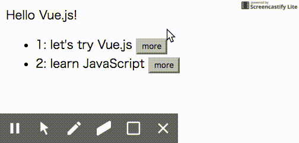

Vue.js for Dynamic Modal Window
===============================

A sample code for using Vue.js to display a dynamic modal window.

There are many modal window samples, such as [Vue.js official site]() 
but many of the samples have a static content modal window.

### install

```
git clone https://github.com/asaokamei/vue2-dynamic-modal
```

* static modal window: [index.html](index.html).
* dynamic modal window: [tasks.html](tasks.html).


A dynamic modal window
----------------------

The gif image below is the sample of "dynamic modal window".



by clicking on a button in the task list, a modal window pops up 
with the content of the corresponding task. 


### Event Hub for Communicating Between Components

The task list is managed by the main Vue application, and 
the modal window is managed by the 'modal' components. 

To pass the task to display in the modal window, 
this sample uses an **event hub** object to 
[communicate between components](https://vuejs.org/v2/guide/migration.html#dispatch-and-broadcast-replaced). 


